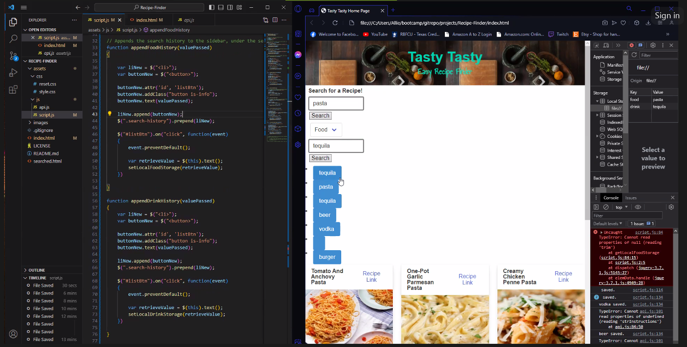

# Tasty Tasty: Recipe-Finder
GitHub Repository: https://github.com/Acolyte03/Recipe-Finder  
Tasty Tasty Website: https://acolyte03.github.io/Recipe-Finder/

## Objective
Using two free APIs to design, create, and implement a front-end application using HTML/CSS/JavaScript.

## Description
It is difficult these days to find easy to make, fun, and delicious recipes.  
We are looking to remedy this.  
Simply type in a food item you are craving and our application will provide you with the top six food recipes.  
The same applies to drink items- simply type in a drink that you desire and the Tasty Tasty app will 
provide back the top six drink mix recipes.

## Using our Application
Upon loading our website, use the search box to input your desired food item.  
Next, select from the dropdown menu if you would also like a beverage pairing to go with your recipe.  
Finally, click on the search button and you will receive the Top 6 Recipes for that food item.  
If you selected the beverage pairing option, you will also be given beverages that go best with your recipes. 

## Technology Used and Resources
We utilized these programming languages, software, APIs, and websites.

---PROGRAMMING LANGUAGES---  
HTML  
CSS  
JavaScript  

--SOFTWARE/FRAMEWORK---  
VSCode  
CSS Framework: Bulma at https://bulma.io/  

---APIs---  
Food API: https://tasty.co/  
Beverage API: https://www.thecocktaildb.com/api.php  

---WEBSITES---  
jQuery: https://jqueryui.com/  
W3Schools: https://www.w3schools.com/  
Mozilla: https://developer.mozilla.org/en-US/  

## Screenshots
These are screenshots of the project from the beginning concepts to the final phases.  

First meeting with concept ideas and design.  
   
 
 Application design outline and webpage display.  
   

 Application webpage layout.  
   

 Allie tinkering with local Storage.  
   

 Group testing our application.  
   

 Group testing local storage in the website.  
   

 Final homepage design.  
  

## Reflection, Future Improvement, and What We Learned
Unfortunately, not everything that was planned was able to be completed.  
Due to time constraints, some ideas didn't make it into our application.  
If time was not an issue, we would include the following in our application:  
1. Improve UI styling which includes getting rid of the temporary cards that exist before our user searches.
2. Allow our user to further customize their search. For example, the user would be able to search by most popular or the newest recipe/beverage.
3. Make our applications homepage more easily understood at a glance and accessible to all users.
4. Go from having two search buttons to only a single search button to search for food and beverages simultaneously.
5. Ensure that our website works at a higher percentage due to how our current website and APIs format data.

## Credits
Made by:  
Allie Stewart: https://github.com/AllieStewart  
Aeryk Andrews: https://github.com/Acolyte03  
Albert Aleman: https://github.com/aalemanyz67  
AKA Group 10, best group, 10/10.

## Licenses
Please refer to the LICENSE in the repository.
